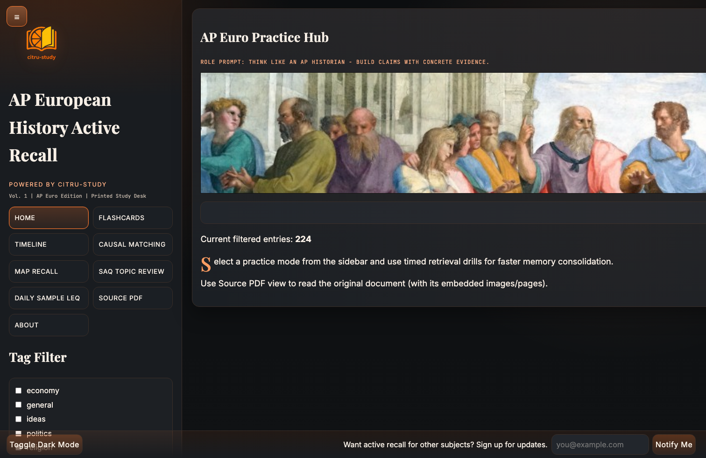
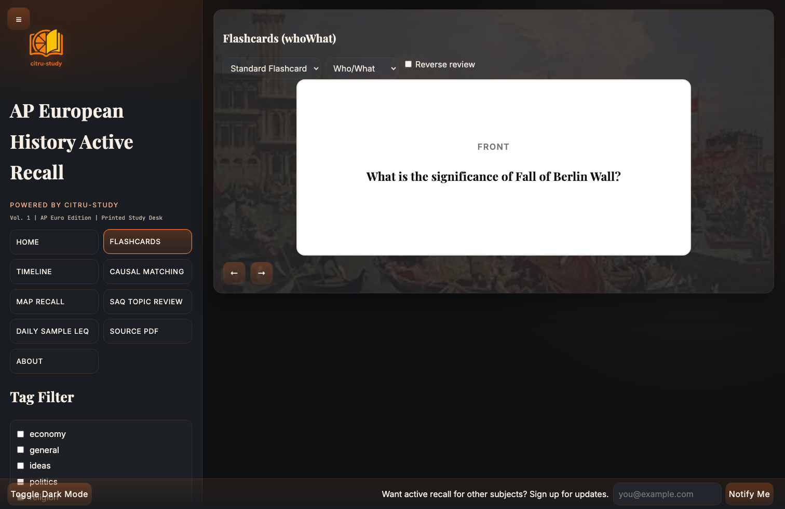
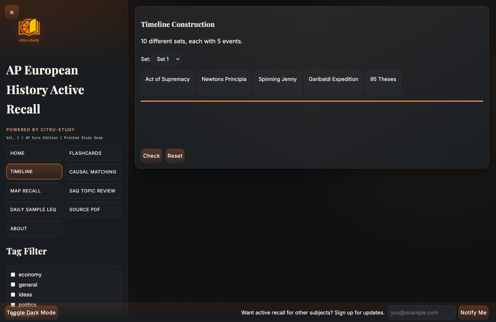
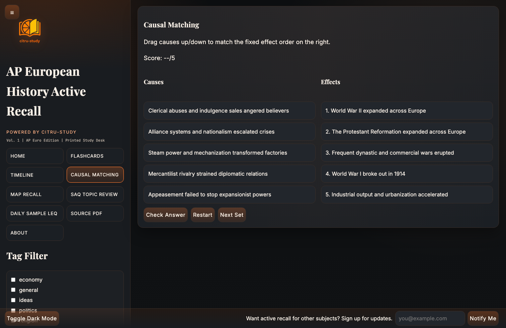
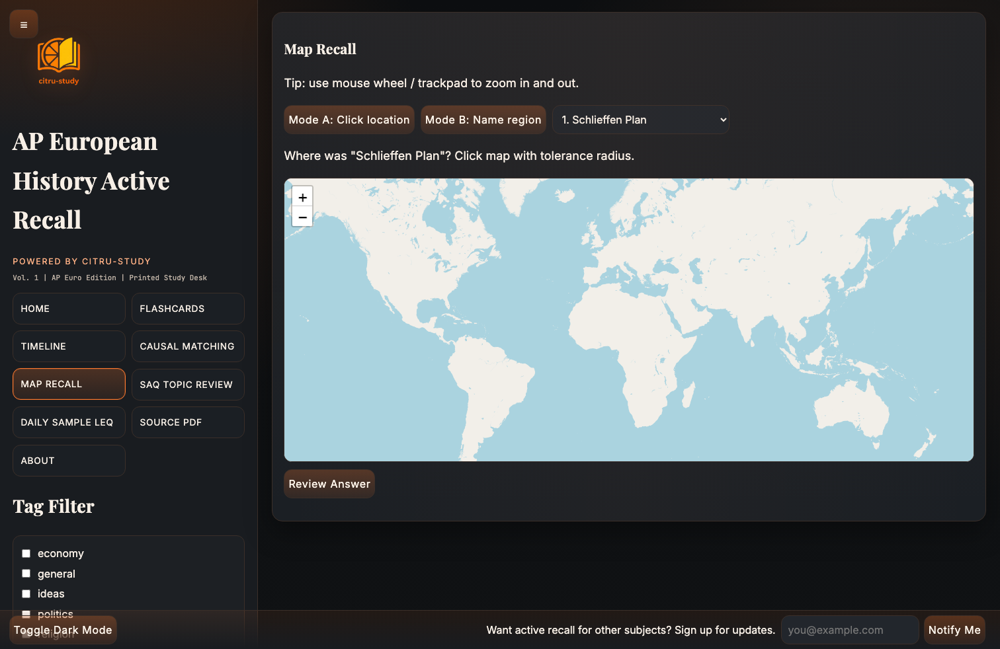
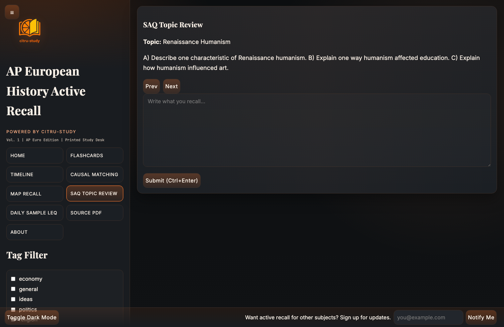
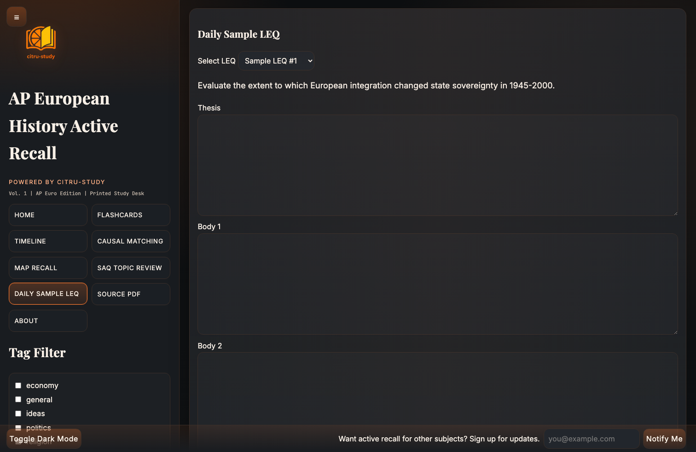
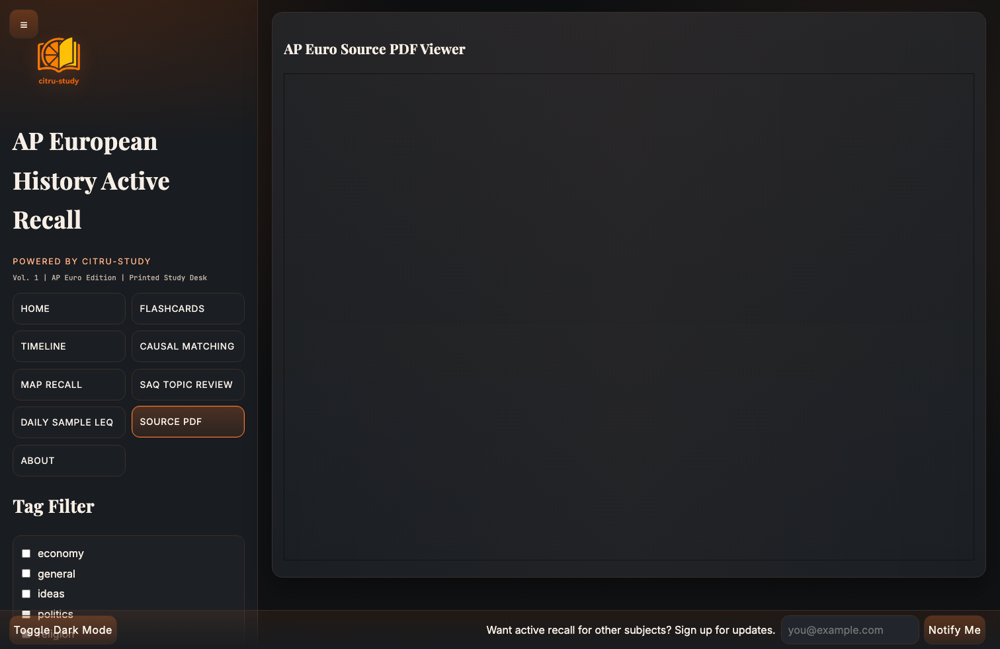
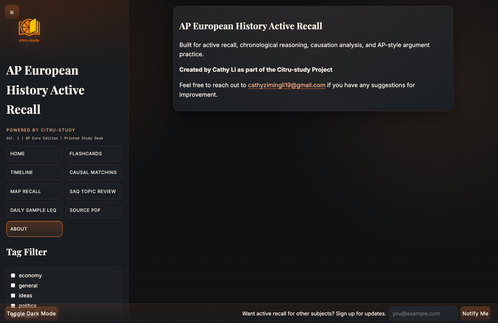
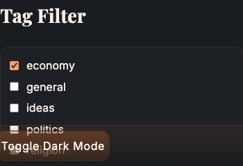

# AP Euro Active Recall / AP 欧史主动回忆练习

<p align="center">
  
</p>

<p align="center"><em>Part of the <strong>Citru-study</strong> learning tools — AP European History edition.</em></p>

---

## English

### Overview
`ap-european-history-active-recall` is a **static, zero-build** web app for AP European History exam prep. Open `index.html` or serve the folder over HTTP and practice entirely in the browser: no npm install required for learners (only plain HTML/CSS/JavaScript modules).

It is built around **active recall**: you retrieve facts under light time pressure, reinforce with **spaced repetition (SM-2)** on flashcards, and practice **College Board–style reasoning** through SAQ prompts, timelines, causal ordering, maps, and a rotating LEQ sample.

### Branding
This project ships under the **Citru-study** project. Sidebar copy references “Powered by Citru-study”; the logo above (`assets/icons/citru-study.png`) is the primary brand mark (updated to the latest attached brand asset). Home uses a separate hero image (`assets/images/home-hero.png`) for atmosphere only — it is **not** mixed into the flashcard image rotation.

### Visual system
The UI now follows a **near-black / dark charcoal** base with **warm orange accents** (terracotta, peach, burnt orange), rounded components, and flat high-contrast surfaces. Navigation and controls are arranged in compact grid-like blocks for quick scanning while studying.

### Flashcard UI & behavior
- **Reverse review** is **off by default** (checkbox unchecked). Turn it on to interleave reversed Q↔A cards for the same prompts.
- Card faces use a fixed **white front** (`#ffffff` text area) and **black back** (`#000000`) with contrasting type, independent of the app light/dark theme.
- Click the card or press **Space** to flip; use **Left / Right** (or the arrow buttons) to navigate.

### Flashcard imagery (local assets only)
Flashcard backgrounds use **only** the author-provided PNGs in `assets/images/`:

- `flash-1.png` … `flash-7.png`

Each topic entry is **deterministically** mapped to one of these seven images (stable for the same `id`), then the flashcard loader tries alternates from the pool if a file fails to load. **External URLs from `data.json` are not used** for flashcard visuals, so offline usage and consistent branding stay predictable. The Citru-study logo and home hero are excluded from this pool.

### Interface screenshots

| | |
|:--|:--|
|  | **Home** — Practice hub: hero banner, horizontally scrolling ticker of filtered topics, and count of entries matching current filters. |
|  | **Flashcards** — White question face / black answer face; Who/What, Cause/Effect, Concept modes; optional **Cloze** from `{{blanks}}`. **Reverse review** is **off by default** (enable to add reversed cards). Background art is low-opacity local imagery only. |
|  | **Timeline Construction** — Ten preset sets; drag or assign order for five dated items per set to drill chronology. |
|  | **Causal Matching** — Order steps or links; submit and see scoring feedback aligned to the exercise. |
|  | **Map Recall** — Leaflet-based map with zoom/pan; recall place names or regions tied to entries, then reveal answers. |
|  | **SAQ Topic Review** — Short-answer–style prompts with bullet “model” points for self-check. |
|  | **Daily Sample LEQ** — Long-essay–style prompt with scaffolding hints and a sample analytical response. |
|  | **Source PDF** — Inline `<iframe>` for the bundled `ap-euro-guide.pdf` (same folder as images) for reading source material. |
|  | **About** — Credits, project blurb, maintainer email. |
|  | **Tag & period filters** — Virtualized checkbox lists in the sidebar; combine theme tags with AP period bands to shrink the active dataset everywhere (home ticker + drills). |

### Feature summary
| Area | Details |
|:-----|:--------|
| Flashcards | White front / black back; reverse review **default off**; Space to flip; Left/Right to navigate |
| Filters | Tags + time periods; filters apply globally to eligible entries |
| Timeline / Matching / Map / SAQ / LEQ | Each view consumes the **same filtered** `data.json` slice |
| Theme | Default dark-charcoal + orange design system; dark toggle still available via app state |
| Shortcuts | `?` toggles help overlay; `Escape` returns home (see in-app overlay for full list) |
| Data | Single `data/data.json` array of events with dates, tags, causes, `content.flashcard`, optional cloze text, etc. |

### Possible enhancements (optional)
- Export/import SRS JSON for backup across machines  
- Session timer or streak counter on Home  
- URL hash to deep-link a view  

### Filtering (Tag + Time Period)
- Use **Tag Filter** for thematic tags (e.g. politics, religion) and **Time Periods** for College Board period labels attached to entries.  
- Empty selection typically means “all” (see app behavior for edge cases).  
- Combining filters narrows both review queues and the home ticker text.

### Run locally
**Option A — open file**  
Double-click `index.html` (some browsers restrict module loading from `file://`; if anything fails, use Option B).

**Option B — static server (recommended)**  
From the parent folder that contains `ap-european-history-active-recall/`:

```bash
python3 -m http.server 5500
```

Then open: [http://localhost:5500/ap-european-history-active-recall/](http://localhost:5500/ap-european-history-active-recall/)

### Project structure (abbreviated)
```text
ap-european-history-active-recall/
├── index.html
├── css/styles.css
├── js/                    # ES modules: store, SRS, views under js/ui/
├── data/data.json         # Topic entries (flashcard text; media.image URLs ignored for flash BG)
├── assets/
│   ├── icons/citru-study.png
│   ├── images/            # flash-1..7, home-hero, ap-euro-guide.pdf
│   └── screenshots/       # README screenshots only
└── README.md
```

### Maintainer
**Cathy Li** — [`cathyzimingli19@gmail.com`](mailto:cathyzimingli19@gmail.com)

---

## 中文（简体）

### 项目说明
本仓库 **`ap-european-history-active-recall`** 是一套面向 **AP 欧洲史** 备考的浏览器端练习站：**无需打包构建**，用静态文件即可运行（学习者只需打开页面或起一个最简单的 HTTP 服务）。

核心理念是 **主动回忆**：在适度压力下提取知识；闪卡配合 **间隔重复（SM-2）**；并通过 SAQ、时间线、因果链、地图与轮换 LEQ 模拟 **贴近考试的论述与史料思维**。

### 品牌与标识
项目归属 **Citru-study** 系列工具；侧边栏有 “Powered by Citru-study” 文案。文首 Logo 文件路径为 **`assets/icons/citru-study.png`**（已替换为最新上传版本）。首页大图使用 **`assets/images/home-hero.png`**，仅作氛围展示，**不参与**闪卡配图轮播。

### 视觉系统
全站采用 **近黑/深炭灰** 底色 + **暖橙色系** 强调（陶土橙、蜜桃橙、焦橙），组件统一圆角、扁平化与高对比；导航与控制区以紧凑网格方式组织，适合高频刷题场景。

### 闪卡界面与默认行为
- **Reverse review（逆序复习）** 默认 **关闭**（复选框未勾选）；开启后会在同一批提示中混入「背面→正面」的反向卡。
- 卡面固定为 **正面白底**、**背面黑底**（与全站明暗主题无关），便于区分问答面。
- 点击卡面或 **空格** 翻面；用 **左右方向键**（或页面按钮）切换上一张/下一张。

### 闪卡配图规则（仅使用本地上传图）
闪卡背景 **只使用** `assets/images/` 下作者提供的：

- `flash-1.png` … `flash-7.png`

每条题目会按条目 `id` **固定映射**到其中一张（同一词条多次复习配图一致）；若某张加载失败，会按顺序尝试同目录下其余几张。**不再使用 `data.json` 里的外链图作为闪卡背景**，以保证离线可用与视觉可控。Logo 与首页 hero **明确排除**在闪卡池之外。

### 界面截图说明

| | |
|:--|:--|
|  | **首页** — 练习入口：横幅图、筛选后主题的横向滚动播报、当前筛选条件下条目数量。 |
|  | **闪卡** — **正面白 / 背面黑**；SM-2 三档评分；Who/What、因果、概念；可选 **Cloze**；**逆序复习默认关闭**（勾选后启用）；背景为低透明度本地图（flash-1～7）。 |
|  | **时间线** — 多组题目，每组五个事件排序，训练时间先后。 |
|  | **因果匹配** — 拖拽或调整顺序并提交，查看反馈。 |
|  | **地图回忆** — 可缩放地图，回忆地名/区域后查看答案。 |
|  | **SAQ Topic Review** — 短答式提问与要点式参考，便于自查。 |
|  | **Daily Sample LEQ** — 长作文型题目、提示与参考论述。 |
|  | **Source PDF** — 内嵌阅读打包的指南 PDF。 |
|  | **About** — 说明与联系方式。 |
|  | **标签与时期** — 侧边栏勾选主题与 AP 时间段，全局缩小题库范围。 |

### 功能一览（简要）
| 模块 | 说明 |
|:-----|:-----|
| 闪卡 | 正面白 / 背面黑；逆序复习默认关；SM-2 持久化（IndexedDB，失败时用 localStorage）；空格翻面；数字键评分 |
| 筛选 | 标签 + 时期联动首页与各练习视图 |
| 多题型 | 共用同一套 `data.json` 筛选结果 |
| 主题 | 默认深炭灰 + 橙色设计系统，仍支持应用内主题切换 |
| 快捷键 | `?` 打开帮助层；`Escape` 回首页（其余见页面内说明） |

### 可选后续增强
- SRS 数据导出/导入  
- 学习计时或连续打卡  
- URL 直达某一视图  

### 筛选逻辑（Tag + Time Period）
- **Tag Filter** 按主题标签筛选；**Time Periods** 按条目上的时期字段筛选。  
- 组合使用可同时在「主题 + 时段」上收窄练习范围。

### 本地运行
**方式 A**：双击 `index.html`（若浏览器对 `file://` 限制模块加载，请用方式 B）。

**方式 B（推荐）**：在包含 `ap-european-history-active-recall` 文件夹的上一级目录执行：

```bash
python3 -m http.server 5500
```

浏览器访问： [http://localhost:5500/ap-european-history-active-recall/](http://localhost:5500/ap-european-history-active-recall/)

### 维护者
**Cathy Li** — [`cathyzimingli19@gmail.com`](mailto:cathyzimingli19@gmail.com)
